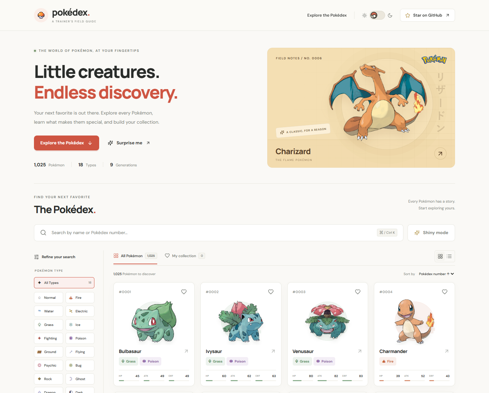
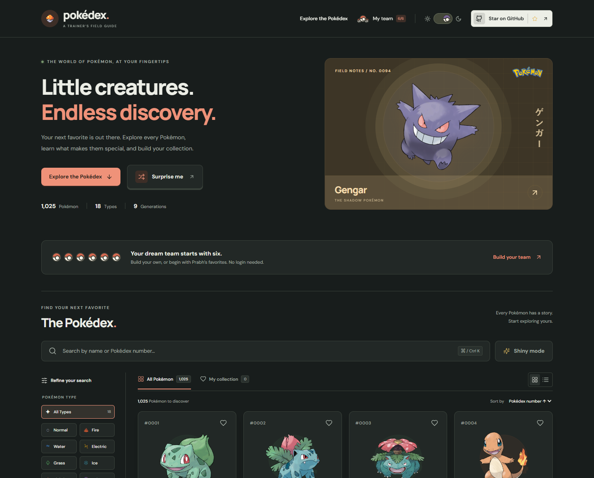
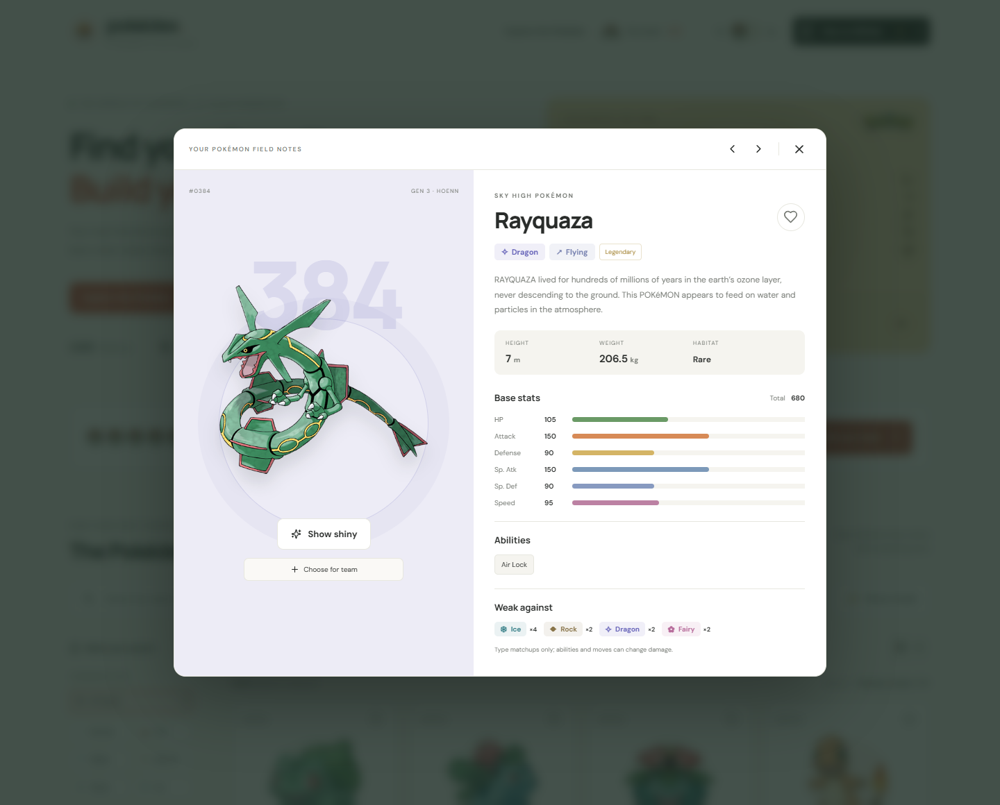
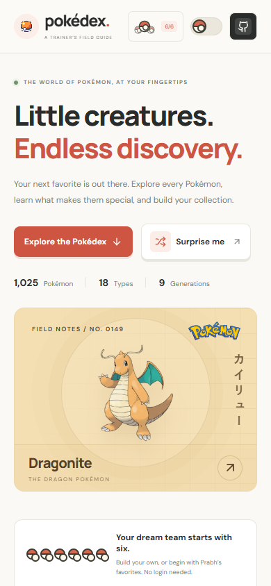

<div align="center">


# Pokédex · A Trainer’s Field Guide

**Little creatures. Endless discovery.**

A thoughtfully crafted window into the world of Pokémon.<br />
Warm paper, official artwork, and 1,025 new reasons to explore.

[](https://github.com/PRABHMANNAT/Pokedex/actions/workflows/ci.yml)
[](https://github.com/PRABHMANNAT/Pokedex/stargazers)


[](https://pokeapi.co/)

[Explore the features](#a-better-way-to-explore) · [Run locally](#your-first-encounter) · [Contribute](CONTRIBUTING.md) · [Credits](ATTRIBUTION.md)

<br />



<sub>Actual browser capture. Original Pokémon artwork. No generated promotional imagery.</sub>

</div>

## A better way to explore

Your next favorite might be in Kanto. Or it might be #1025. Search the **entire National Pokédex** from the first keystroke; the app never limits discovery to a partially loaded page.

| For the curious trainer | What you get |
| --- | --- |
| **Find your next favorite** | Search by name or National ID; combine all 18 type filters with nine generations and legendary/mythical categories. |
| **Make it yours** | Save Pokémon to a local collection with one tap. Your collection survives reloads and syncs across browser tabs. |
| **Look a little closer** | Open field notes with six base stats, abilities, height, weight, type weaknesses, and evolution connections. |
| **Chase a different sparkle** | Switch cards and detail artwork to shiny variants, where the source provides them. |
| **Explore your way** | Sort by name, number, or base-stat total; use compact cards, load more entries, or meet a random Pokémon. |
| **Day or night** | A Poké Ball theme switch, a saved theme preference, and a carefully balanced dark palette. |
| **Share an encounter** | Copy filter URLs or link directly to a Pokémon. Keyboard search, Escape-to-close dialogs, and reduced-motion support are built in. |

<div align="center">
<br />

<br /><br />

<br /><br />

<br />
<sub>From a wide desktop to a pocket-sized screen.</sub>
</div>

## Your first encounter

Use **Node.js 22.12+** or Node 24.

```bash
git clone https://github.com/PRABHMANNAT/Pokedex.git
cd Pokedex
npm ci
npm run dev
```

Open **http://localhost:5173**. No API key or environment configuration is needed.

```bash
npm run build       # Production files → dist/
npm run preview     # Preview the production build
npm run lint        # Check the source
npm test            # Validate catalog, filters, storage, and type matchups
```

To run the real browser journeys:

```bash
npx playwright install chromium
npm run test:e2e
```

The browser suite covers discovery, combined filters, collection persistence, shiny mode, theme changes, modal focus, direct routes, network failure, and mobile layout.

## Under the cover

**React + Vite + React Router + Lucide**, with plain CSS and a deliberately small runtime dependency set.

The complete catalog ships with the app, so filters and statistics don't require hundreds of API requests. Extra species field notes load only when you open details. Artwork comes from the [PokéAPI sprite repository](https://github.com/PokeAPI/sprites), and the logo comes from [Wikimedia Commons](https://commons.wikimedia.org/wiki/File:International_Pok%C3%A9mon_logo.svg).

```text
src/
  components/      Explorer, cards, filters, field notes, and theme controls
  hooks/           Persistent collection and theme state
  data/            Generated national index and type chart
  lib/             Search, formatting, storage, and matchup helpers
  styles/          Catalog, details, and responsive layouts
scripts/           Catalog refresh and real screenshot capture
tests/             Data checks and Playwright browser journeys
docs/              Data schema, design notes, and screenshots
```

- [Data model & refresh process](docs/DATA_MODEL.md)
- [Design notes](docs/DESIGN.md)
- [Hosting guide](docs/DEPLOYMENT.md)
- [Contributing](CONTRIBUTING.md)

Run `npm run data:sync` to regenerate the catalog from PokéAPI. The generator intentionally pins the National Pokédex to **1,025 default entries** and validates the result. Alternate forms and battle-specific ability effects are outside this version.

The index and saved collection remain usable if the species API is unavailable. Artwork and extra field notes need network access. Favorites stay in your browser; there is no account or cloud sync.

## A small invitation

Found a bug? [Open an issue](https://github.com/PRABHMANNAT/Pokedex/issues/new/choose). Have a thoughtful idea? Pull up a chair and [contribute](CONTRIBUTING.md).

If this field guide makes you smile, a [GitHub star](https://github.com/PRABHMANNAT/Pokedex) helps other trainers find it.

<div align="center">


<sub>An independent fan project. Pokémon © Nintendo / Creatures Inc. / GAME FREAK Inc.<br />
See [asset attribution and original project credit](ATTRIBUTION.md). No affiliation or endorsement is implied.</sub>

</div>
