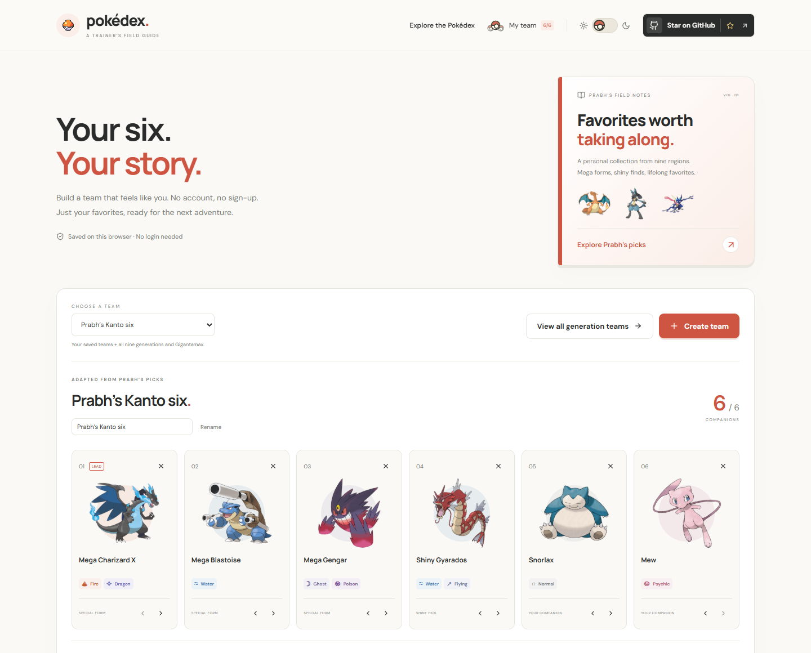
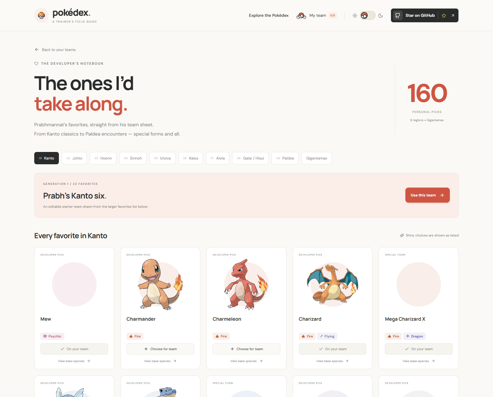
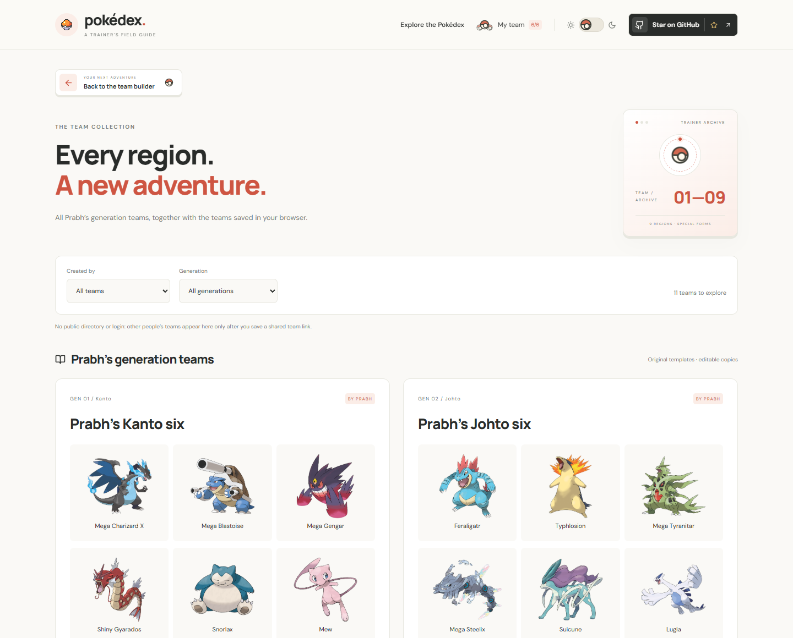
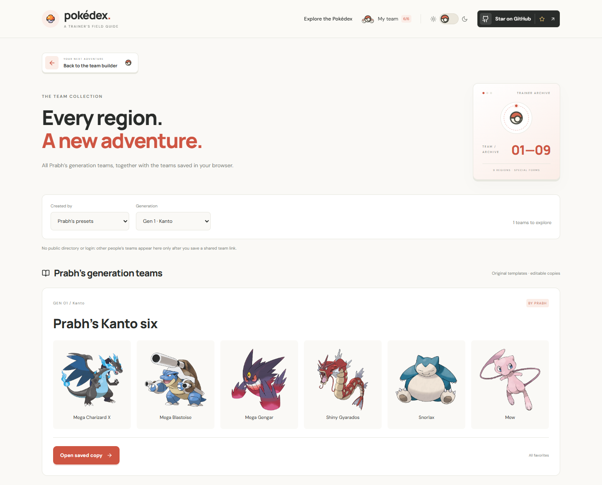
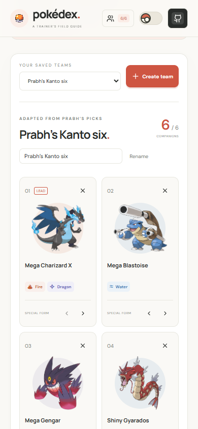

<div align="center">


# Pokédex · A Trainer’s Field Guide

**Find your favorites. Build your adventure.**

A Pokémon field guide for collectors, curious trainers, and your next favorite team.<br />
Explore 1,025 Pokémon. Build your six. Discover every generation.<br />
Warm paper by day, charcoal by night — with original Pokémon artwork throughout.

[](https://github.com/PRABHMANNAT/Pokedex/actions/workflows/ci.yml)
[](https://github.com/PRABHMANNAT/Pokedex/stargazers)


[](https://pokeapi.co/)

[Explore the features](#a-better-way-to-explore) · [Run locally](#your-first-encounter) · [Contribute](CONTRIBUTING.md) · [Credits](ATTRIBUTION.md)

<br />


<sub>Actual browser capture. Original Pokémon artwork. No generated promotional imagery.</sub>

</div>

## A better way to explore

Your next favorite might be in Kanto. Or it might be #1025. Search the **entire National Pokédex** from the first keystroke; the app never limits discovery to a partially loaded page.

| For the curious trainer        | What you get                                                                                                                       |
| ------------------------------ | ---------------------------------------------------------------------------------------------------------------------------------- |
| **Find your next favorite**    | Search by name or National ID; combine all 18 type filters with nine generations and legendary/mythical categories.                |
| **Make it yours**              | Save Pokémon to a local collection with one tap. Your collection survives reloads and syncs across browser tabs.                   |
| **Build your six**             | Create named, login-free teams, choose a lead, compare type diversity and shared weaknesses, and share a team link.                |
| **Meet the developer’s picks** | Explore Prabh’s personal favorites across nine regions and Gigantamax forms, with editable six-member starter teams.               |
| **Look a little closer**       | Open field notes with six base stats, abilities, height, weight, type weaknesses, and evolution connections.                       |
| **Chase a different sparkle**  | Switch cards and detail artwork to shiny variants, where the source provides them.                                                 |
| **Explore your way**           | Sort by name, number, or base-stat total; use compact cards, load more entries, or meet a random Pokémon.                          |
| **Day or night**               | A Poké Ball theme switch, a saved theme preference, and a carefully balanced dark palette.                                         |
| **Share an encounter**         | Copy filter URLs or link directly to a Pokémon. Keyboard search, Escape-to-close dialogs, and reduced-motion support are built in. |

<div align="center">
<br />

<br /><br />

<br /><br />

<br />
<sub>From a wide desktop to a pocket-sized screen.</sub>
</div>

## Six companions. Your own story.

Start with **Prabh’s Kanto six**, then make it yours — or create a fresh team from any of the 1,025 Pokémon. Save multiple named teams, reorder your lead, and add companions from cards or field notes. The developer notebook preserves the favorites, shiny choices, and special forms from Prabhmannat’s personal team sheet.





Teams save **only in your browser**, without an account. Share links include the lineup and team name; anyone with the link can read them and save a separate copy. Clearing browser data removes your local teams. Type summaries are helpful starting points, not a battle simulator: abilities, moves, items, and special battle rules are not modeled.

[Team builder & data notes](docs/TEAMS.md)

Browse every regional starter team together in the **team collection**, then filter Prabh’s templates or your browser-saved lineups by generation. Jump between regions directly from the editor without losing changes to your saved copies.

The collection gives each lineup room to breathe: larger artwork, wide two-column previews, and a full-width showcase when a filter returns one team. A Poké Ball archive scan introduces the collection, while a trainer-style back button takes you straight to the builder. Animations respect reduced-motion preferences, and previews adapt to smaller screens.





<sub>One region in focus. Six favorites, side by side. Real screenshots from the app.</sub>



## Your first encounter

Use **Node.js 22.12+** or Node 24.

```bash
git clone https://github.com/PRABHMANNAT/Pokedex.git
cd Pokedex
npm ci
npm run dev
```

Open **http://localhost:5173**. No API key or environment configuration is needed.

```bash
npm run build       # Production files → dist/
npm run preview     # Preview the production build
npm run lint        # Check the source
npm test            # Validate catalog, filters, storage, and type matchups
```

To run the real browser journeys:

```bash
npx playwright install chromium
npm run test:e2e
```

The browser suite covers discovery, filters, collection persistence, themes, modal focus, direct routes, network failure, team editing, lead ordering, sharing, storage failures, developer presets, collection filters, responsive team previews, keyboard navigation, and reduced-motion behavior. **17 unit tests and 21 browser journeys** run in GitHub’s quality checks.

## Under the cover

**React + Vite + React Router + Lucide**, with plain CSS and a deliberately small runtime dependency set.

The complete catalog ships with the app, so filters and statistics don't require hundreds of API requests. Extra species field notes load only when you open details. Artwork comes from the [PokéAPI sprite repository](https://github.com/PokeAPI/sprites), and the logo comes from [Wikimedia Commons](https://commons.wikimedia.org/wiki/File:International_Pok%C3%A9mon_logo.svg).

```text
src/
  components/      Explorer, field notes, team builder, collection, and notebook
  hooks/           Persistent teams, favorites, and theme state
  data/            National index, type chart, and curated developer picks
  lib/             Search, formatting, storage, and matchup helpers
  styles/          Catalog, details, and responsive layouts
scripts/           Catalog refresh and real screenshot capture
tests/             Data checks and Playwright browser journeys
docs/              Data schema, design notes, and screenshots
```

- [Data model & refresh process](docs/DATA_MODEL.md)
- [Design notes](docs/DESIGN.md)
- [Hosting guide](docs/DEPLOYMENT.md)
- [Contributing](CONTRIBUTING.md)

Run `npm run data:sync` to regenerate the catalog from PokéAPI. The generator pins the National Pokédex to **1,025 default entries** and validates the result. The developer notebook separately supports curated alternate forms; run `npm run data:forms` to refresh their types and stats. Battle-specific ability effects are not simulated.

The index, team builder and saved collection remain usable if the species API is unavailable. Artwork and extra field notes need network access. Favorites and teams stay in your browser; there is no account or cloud sync.

## A small invitation

Found a bug? [Open an issue](https://github.com/PRABHMANNAT/Pokedex/issues/new/choose). Have a thoughtful idea? Pull up a chair and [contribute](CONTRIBUTING.md).

If this field guide makes you smile, a [GitHub star](https://github.com/PRABHMANNAT/Pokedex) helps other trainers find it.

<div align="center">


<sub>Made by Prabhmannat Singh with a lot of time, care, and love.<br />
An independent fan project. Pokémon © Nintendo / Creatures Inc. / GAME FREAK Inc.<br />
See [asset attribution and original project credit](ATTRIBUTION.md). No affiliation or endorsement is implied.</sub>

</div>
